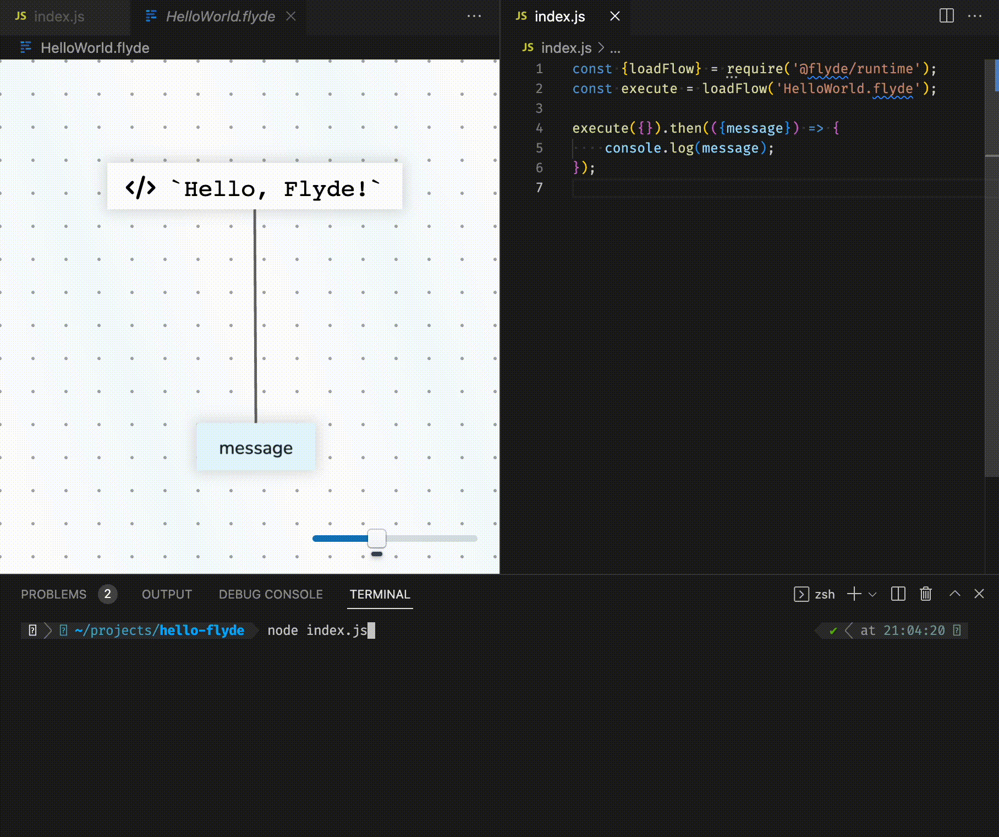

# Hello World with Flyde

This tutorial will guide you step-by-step into creating an "Hello world" program using Flyde. For simplicity, we will use vanilla JS. For TS support check any of the official examples.

This is how the end result should look like:

Resulting code can be in the [examples folder](https://github.com/FlydeHQ/flyde/tree/main/examples/hello-flyde).

## What you'll need

- [Node.js](https://nodejs.org/en/download/) (LTS version recommended)
- [VS Code](https://code.visualstudio.com/)
- [Flyde for VSCode](https://marketplace.visualstudio.com/items?itemName=flyde.flyde-vscode)

## Instructions

### Create a new project

1. Navigate to projects favorite folder
1. `mkdir hello-flyde && cd hello-flyde` - create a new folder to host our future project
1. `npm init --yes` - initializes an empty npm project
1. `npm install @flyde/runtime && @flyde/stdlib` - install the runtime package (runs Flyde projects) and the Flyde stdlib
1. `code .` to open the project's folder using VSCode. If it's not working, check out [this article](https://code.visualstudio.com/docs/editor/command-line#_code-is-not-recognized-as-an-internal-or-external-command) or just open the folder you've created using VSCode

### Code-based sanity checkpoint

To ensure everything is installed properly, paste the following into a new file named `index.js`:

```
const {loadFlow} = require('@flyde/runtime');

console.log('Hello, world!');
```

Then run `node index.js` in the terminal and make sure you're seeing the "Hello, world!" message.

### Creating a visual Flyde flow

Now we're getting to the real deal, creating a visual flow!

1. Right click on the VSCode's sidebar -> "Flyde: New Visual Flow"
2. Name your flow "HelloFlyde" -> accept the file name "HelloFlyde.flyde"
3. Now Flyde will ask you for the flow's inputs and outputs. Flyde accept multiple inputs and multiple outputs, but for this example we need no inputs and just 1 output named "message".
4. You should now see a Flyde flow editor tab inside your IDE!


### Working with the flow editor

Now it's time to do some changes!
1. click on the "Your logic here!" part and press delete to remove it from the board
2. right click the board and select "New value"
3. Type in `"Hello, Flyde!"` (make sure it's surrounded by quotes so it's a valid string)
4. Now connect the "r" output pin to the "result" flow's output pin by first clicking on the "r" pin and then on the result (or vice-versa)
5. Don't forget to save (using regular VSCode controls)


### Running your flow from the code

We'll use the `@flyde/runtime` module to load our newly created .Flyde file and execute it, logging the result back to the console.

1. Open `index.js`
2. Paste the following code:
```javascript
const {loadFlow} = require('@flyde/runtime');
const execute = loadFlow('HelloFlyde.flyde');

execute()
    .then(({message}) => console.log(message))
```
_it looks much better using [ESM and a top-level await](https://reflectoring.io/nodejs-modules-imports/) but it is out-of-scope for this tutorial_


3. using your terminal (VSCode's embedded one works perfect for this case) run `node index.js`
4. You should see "Hello, Flyde!" in your console!

Did you notice the visual feedback when it ran? Flyde's runtime connects to a socket-based debugger in the IDE to allow new ways of debugging and troubleshooting programs! You can also inspect the inputs and outputs to learn about the data that passed through them.


**Congratulations! You've just finished the first Flyde tutorial ✨**

Before moving on to the next tutorial, I highly recommend you to try tinkering with this example:
- Change the returned string
- add more values and connect them to the same output
- add another output and connect another value to it


## Troubleshooting

TBD
